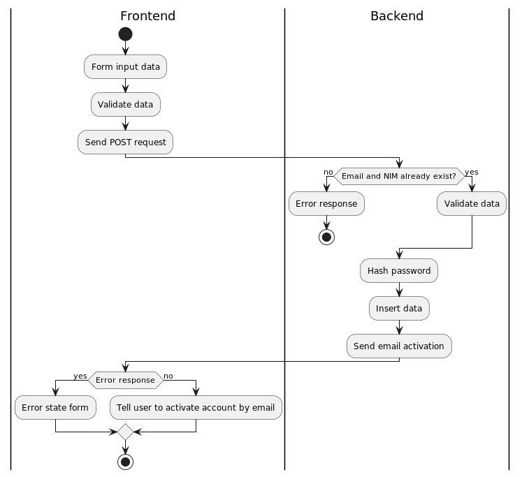
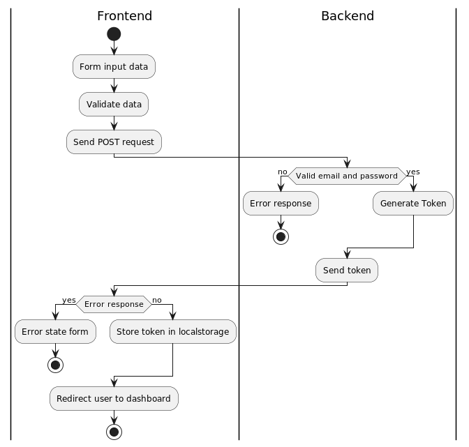
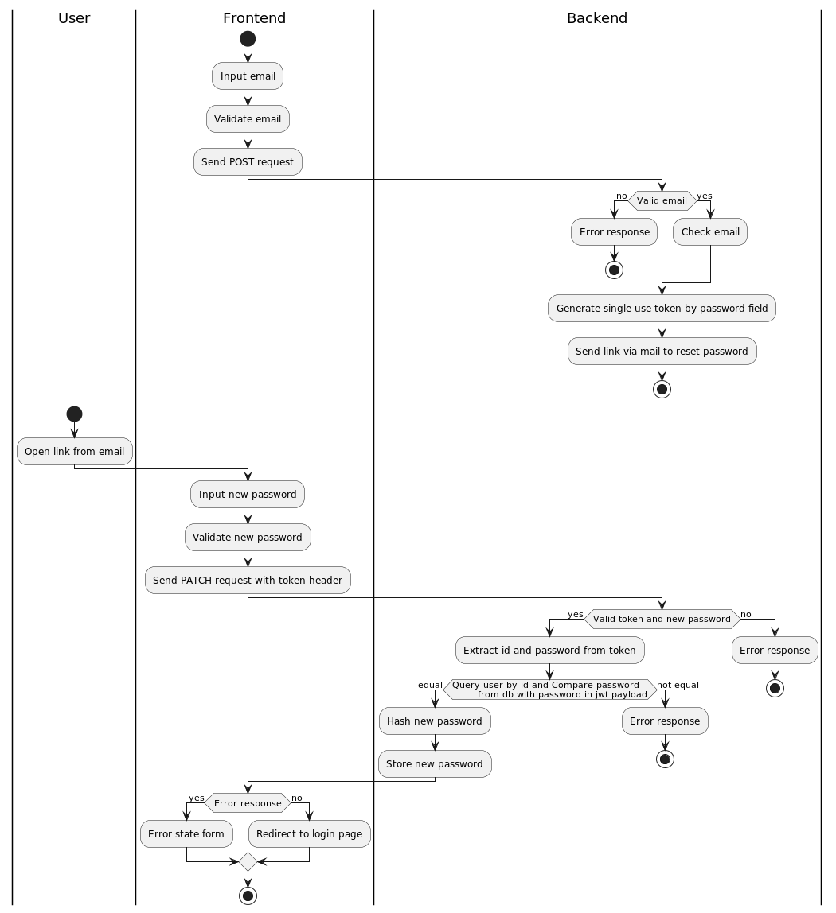
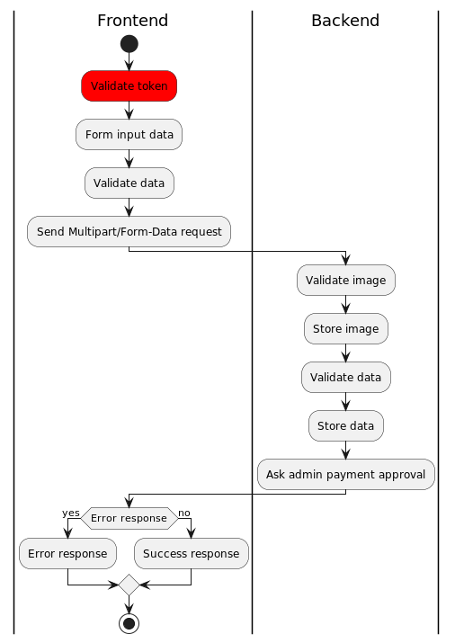

# Sriwijaya Exhibition Backend

A web-based competition registration platform at the Sriwijaya Exhibition with a golang backend.

## How to Run

1. Install the latest stable version of [Go](https://go.dev/dl/)
2. Install the latest stable version of [PostgresSQL](https://www.postgresql.org/download/)
3. Set environtment variable by using [Migrate](https://github.com/golang-migrate/migrate)
4. Install the latest stable version of MakeFile
5. Rename and configure [`.env.example`](.env.example) to `.env`
6. Download all dependecies by using this command
```bash
$ make tidy
```
7. Migrate db by using this command. Make sure all variables in `.env` are matching with your Postgress credentials
```bash
$ make migrate-fresh
```
8. If you want to enable production-mode, add `export GIN_MODE=release`
9. Start server with the following command :

```bash
$ go run cmd/server/main.go
```

## Feature Documentation

This is a documentation of how each feature works using UML with PlantUML. You can use the PlantUML extension on VSCode,
Jetbrains, or the official website.

### Account Register



### Account Login



### Account Forgot Password



### Competition Register


